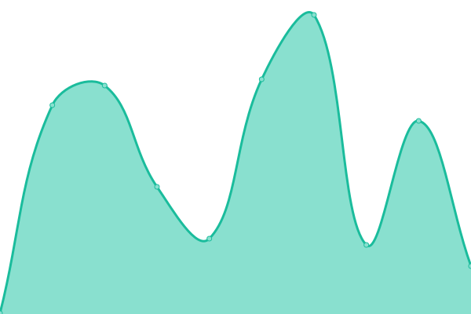
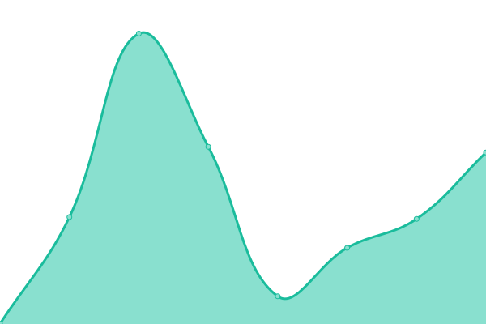
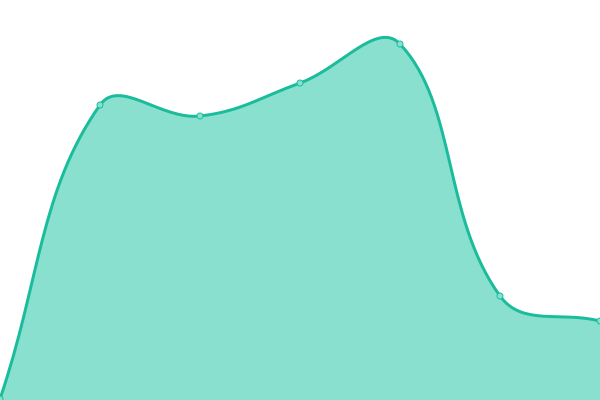
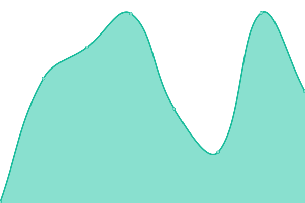

# [📈 Live Status](https://status.customagents.io): <!--live status--> **🟧 Partial outage**

This repository contains the open-source uptime monitor and status page for [WELDON](EVERJUST.ORG), powered by [Upptime](https://github.com/upptime/upptime).

With [Upptime](https://upptime.js.org), you can get your own unlimited and free uptime monitor and status page, powered entirely by a GitHub repository. We use [Issues](https://github.com/ever-just/status/issues) as incident reports, [Actions](https://github.com/ever-just/status/actions) as uptime monitors, and [Pages](https://status.customagents.io) for the status page.

<!--start: status pages-->
<!-- This summary is generated by Upptime (https://github.com/upptime/upptime) -->
<!-- Do not edit this manually, your changes will be overwritten -->
<!-- prettier-ignore -->
| URL | Status | History | Response Time | Uptime |
| --- | ------ | ------- | ------------- | ------ |
|  [Dashboard](https://app.customagents.io) | 🟩 Up | [dashboard.yml](https://github.com/ever-just/status/commits/HEAD/history/dashboard.yml) | 

 2224ms
     
 | 

<a href="https://status.customagents.io/history/dashboard">100.00%</a>
    

|  [API](https://api.customagents.io/health) | 🟥 Down | [api.yml](https://github.com/ever-just/status/commits/HEAD/history/api.yml) | 

 207ms
     
 | 

<a href="https://status.customagents.io/history/api">75.74%</a>
    

|  [Documentation](https://docs.customagents.io) | 🟩 Up | [documentation.yml](https://github.com/ever-just/status/commits/HEAD/history/documentation.yml) | 

 570ms
     
 | 

<a href="https://status.customagents.io/history/documentation">100.00%</a>
    

|  [Trust Center](https://trust.customagents.io) | 🟥 Down | [trust-center.yml](https://github.com/ever-just/status/commits/HEAD/history/trust-center.yml) | 

 223ms
     
 | 

<a href="https://status.customagents.io/history/trust-center">76.35%</a>
    

|  [Compliance Console](https://compliance.customagents.io) | 🟥 Down | [compliance-console.yml](https://github.com/ever-just/status/commits/HEAD/history/compliance-console.yml) | 

 172ms
     
 | 

<a href="https://status.customagents.io/history/compliance-console">76.35%</a>
    

|  [Feedback](https://feed.customagents.io) | 🟥 Down | [feedback.yml](https://github.com/ever-just/status/commits/HEAD/history/feedback.yml) | 

 327ms
     
 | 

<a href="https://status.customagents.io/history/feedback">76.36%</a>
    

<!--end: status pages-->

[**Visit our status website →**](https://status.customagents.io)

## 📄 License

- Powered by: [Upptime](https://github.com/upptime/upptime)
- Code: [MIT](./LICENSE) © [Anand Chowdhary](https://anandchowdhary.com), supported by [Pabio](https://pabio.com)
- Data in the `./history` directory: [Open Database License](https://opendatacommons.org/licenses/odbl/1-0/)
